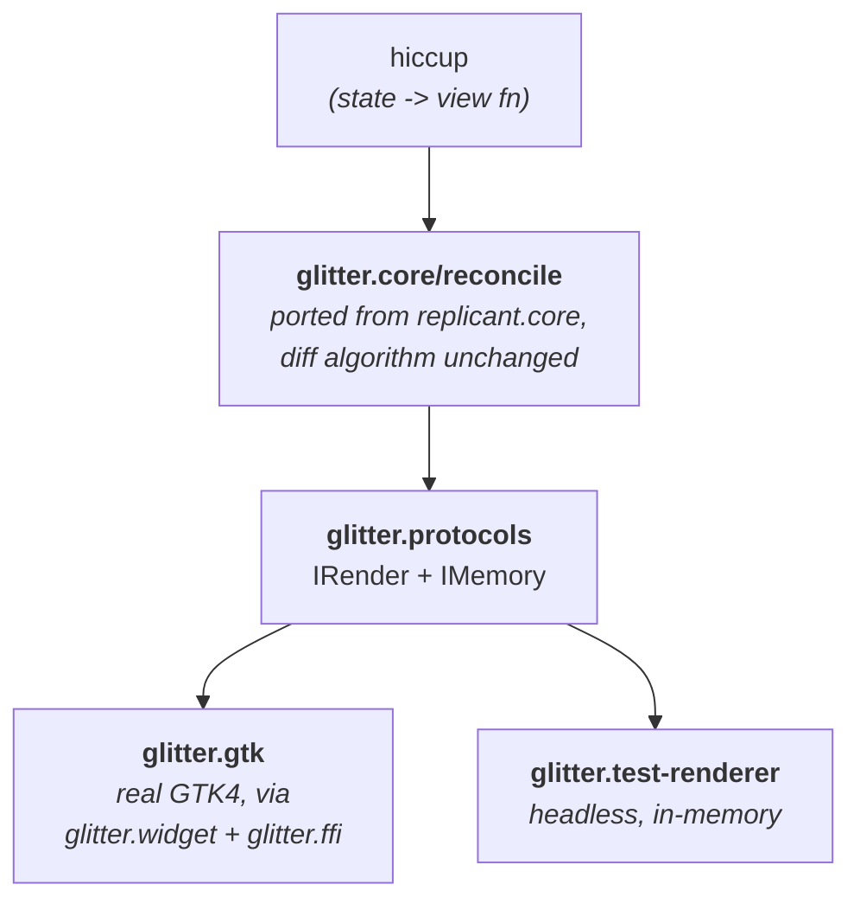

# Contributing

Thanks for taking an interest. glitter is a
[Replicant](https://github.com/cjohansen/replicant)-style GTK4 renderer for
[Jolt](https://github.com/jolt-lang/jolt) (native Clojure on a Chez Scheme
host, no JVM) talking to real GTK4 over its C ABI through `glitter.ffi`.

The deep documentation lives in [`docs/guide/`](docs/guide/index.md) and is
published at <https://jlt-commons.github.io/glitter/>. Edit the Markdown here,
never the site.

Publishing is automatic. `.github/workflows/site.yml` builds the site on every
pull request and deploys it when your change lands on `main`, so a docs change
goes live on merge without anyone running anything. You can preview it locally
with `bb site:serve` if you clone
[jlt-commons/docs-engine](https://github.com/jlt-commons/docs-engine) alongside
this repo, but the pull request build is the authority.

## Setting up

You need Jolt and a native GTK4:

```sh
jolt --version           # developed against v0.6.3; re-verified on v0.7.24 and v0.7.29
brew install gtk4        # macOS; on Linux use your distro's gtk4 + glib dev packages
```

Everything except one demo works on any Jolt in that range. `jolt flights`
wants **v0.7.24 or newer** to show the correct date: Jolt's boot-time libc
zone probe used to leave `TZ=UTC` set process-globally, and zone discovery
reads `TZ`, so an older Jolt puts `(t/today)` back on the UTC date. Fixed in
[jolt-lang/jolt#712](https://github.com/jolt-lang/jolt/pull/712); the other
half is `jolt-lang/time` v0.0.7, which `deps.edn` pins. v0.7.24 also carries
[#716](https://github.com/jolt-lang/jolt/pull/716), which takes `(t/today)`
from ~1.15ms to ~13.6us. See
[`docs/guide/nexus.md`](docs/guide/nexus.md#the-ttoday-is-utc-finding-and-its-upstream-fix)
for the measurements. On an older Jolt the demo still runs, it just defaults
its departure field to the UTC date.

`deps.edn` states that floor as `:jolt/min-version "0.7.24"`, so it is
machine-readable rather than only written down here. A Jolt below a declared
floor refuses to load the project instead of running it. Note this does not
change anything for an older Jolt today: the runtime that reads the key is
v0.8.0 or newer, comfortably above the floor, so a Jolt old enough to have the
date bug ignores the key entirely. It is there for the next breaking change.

`deps.edn`'s `:jolt/native` declares `glib-2.0`, `gobject-2.0`, `gio-2.0` and
`gtk-4`, with Homebrew paths for darwin and `.so` names for linux.

[babashka](https://babashka.org) is optional but makes everything friendlier:
`bb info` prints a grouped cheat-sheet of every task. Without it, use
`jolt -M:<alias>` directly.

## Before you open a PR

```sh
bb test               # unit suite (headless — no display needed)
bb lint:strict        # clj-kondo, non-zero exit on any finding
bb lsp:format-check   # clojure-lsp formatting, dry run
bb smokes             # every live-GTK smoke in sequence (needs a display)
```

`bb lsp:fix` applies formatting and ns cleanup in place if `lsp:format-check`
complains. **Formatting is owned by clojure-lsp**, and the whole codebase is
uniform under it: including the ten files ported verbatim from Replicant. An
earlier decision exempted those to preserve upstream diffability; it was
reversed in favour of one project-wide style. Please don't reintroduce the
exemption for a file you touch.

`bb hooks:install` sets up a fast (~2s) local pre-commit hook: lint errors,
format check, ns check. It's never committed, so each clone opts in.

**`bb lint` needs `.clj-kondo/hooks/jolt_ffi.clj`**, which rewrites
`jolt.ffi/defcfn` into an equivalent `defn` so clj-kondo and clojure-lsp can
see through the FFI macro. Without it every `gtk-*`/`g-*` binding reports as
unresolved.

## Architecture



- `glitter.core` drives *when*: it diffs old vs. new hiccup and calls
  `IRender`/`IMemory` methods. It has no idea GTK exists.
- `glitter.gtk` implements those protocols for real GTK4 widgets, plus
  `mount!` (the state-atom watcher that drives re-render).
- `glitter.widget` maps hiccup tags to widget constructors, prop-appliers and
  container strategies (`glitter.widget/specs`, extensible via
  `register-widget!`), and owns the foreign-callable retain/release
  bookkeeping GTK's C ABI requires.
- `glitter.app` is the GTK4 bootstrap: `GtkApplication`, `:activate` handler,
  and cross-thread marshalling (`on-gui`/`post-to-gui`).
- `glitter.test-renderer` is a fake `IRender`/`IMemory` for headless
  reconciler tests. It ships in `src/`, not `test/`, so applications built on
  glitter can reuse it in their own suites.

Full breakdown: [`docs/guide/architecture.md`](docs/guide/architecture.md).

## Invariants: please don't regress these

Each of these was a real bug at some point. Most are explained at length in
[`docs/guide/`](docs/guide/index.md); the short forms are here so a reviewer
can point at a number.

1. **Never gate CI on `jolt <task>`.** On jolt v0.6.3 a `deps.edn` `:tasks`
   entry didn't propagate its child process's exit status, so `jolt test`
   printed failures and still exited 0. Jolt fixed that in v0.7.28, and on
   v0.7.29 the task form exits correctly (measured as 7). Keep using
   `jolt -M:<alias>` or a `bb.edn` task anyway: glitter runs on jolt from
   v0.7.24, and the fix only lands at v0.7.28, so the task form can still
   swallow a failure on a supported version.

2. **`insert-before` covers two different cases**: a genuinely new child, and
   repositioning an *already-parented* child (a keyed reorder).
   `gtk_box_insert_child_after` asserts its child is unparented and silently
   no-ops otherwise, so `glitter.gtk`'s `insert-before` branches on whether
   `child-node` is already tracked in the parent's `:children`, calling
   `w/insert-child-after!` or `w/reorder-child!` accordingly. Don't "simplify"
   it to always call one.

3. **`replace-child!`'s `:box` branch must capture the old child's previous
   sibling *before* removing it.** `gtk_box_append` always lands at the end, so
   naively removing then appending silently relocates any non-final child.

4. **A prop value of `false` must reach the widget, not be treated as absent.**
   `update-attr`/`set-attributes`/`apply-props!` route on `some?`, not
   truthiness. The DOM has no "boolean absent" state to confuse with `false`;
   GTK booleans (`:sensitive`, `:active`, …) genuinely need `false` applied.
   This is DEVIATION #3 from the pure Replicant port; see
   [`porting-and-attribution.md`](docs/guide/porting-and-attribution.md).

5. **Protocol composition uses `reify`, never `:extend-via-metadata`.**
   Verified broken under Jolt: the with-meta-as-method-table style throws
   `No method create-element in glitter.protocols/IRender` at call time.
   `glitter.gtk`'s and `glitter.test-renderer`'s renderers each implement
   `IRender` *and* `IMemory` in one `reify`; `with-meta` carries only
   auxiliary data (the log/memory atoms), never protocol dispatch.

6. **`on-gui` must run inline when already on the GTK main thread**, rather
   than always marshalling via `g_idle_add`. `glitter.app` tracks the thread
   `g_application_run` actually runs on, so a caller already there (a click
   handler, `mount!`'s watcher firing from a same-thread `swap!`) gets a
   synchronous read-back instead of an unnecessary async hop.
   `examples/glitter/main_thread_smoke.clj` pins this.

7. **`bb.edn`/`deps.edn` `:tasks` bodies are EDN-parsed.** No `#"regex"`,
   `@deref`, or `#(...)` reader macros: use `(re-pattern …)`, `(deref …)`,
   `(fn [x] …)`. Mistakes here abort *every* `bb` invocation, not just the
   edited task.

8. **A value-bearing signal's value doesn't travel through the action tuple.**
   Hiccup `:on` data is static, fixed when `view` runs, so an action can't
   carry a value that only exists once the user types. `glitter.gtk`'s
   `set-event-handler` stuffs the current value onto the event object as
   `:glitter/value`; `glitter.core`'s `build-event-map` wraps that under
   `:glitter/dom-event`. A handler needing live input reads
   `(get-in event [:glitter/dom-event :glitter/value])` from the dispatch
   fn's first argument. See [`nexus.md`](docs/guide/nexus.md) for the
   placeholder-based generalization.

9. **There's no function-as-hiccup-tag convention.** Unlike glimmer/Reagent, a
   helper returning a hiccup fragment is called as a plain function
   (`(my-fn args…)`, spliced into the parent vector), not embedded as
   `[my-fn args…]`. `glitter.hiccup/hiccup?` requires a literal keyword in
   position 0, so a function in tag position is treated as an opaque child
   value and silently stringified into literal text. For a genuinely reusable,
   keyword-addressable component use `glitter.alias/defalias`. Full
   explanation: [`architecture.md`](docs/guide/architecture.md#composing-views-plain-function-calls-not-hiccup-tags).

## Adding a widget

`glitter.widget/specs` maps a hiccup tag to a constructor, a prop-applier and
a container strategy; `register-widget!` adds one from outside the library.
Read [`gtk-widget-layer.md`](docs/guide/gtk-widget-layer.md) first; it is the
long-form record of how every currently-supported widget was added, including
the ones that needed real architectural work.

Two things that reliably surprise people:

- **A new signal shape needs a hand-written branch in
  `glitter.gtk/set-event-handler`.** `jolt.ffi/foreign-callable` is a
  compile-time special form whose argtypes and rettype must be literal at the
  call site, so signal shapes cannot be data-driven. `register-signal!`
  deliberately has no shape parameter, because it could never honour one. The
  standard `void(widget, user_data)` shape is free; anything else (GTK's
  3-arg `"state-set"`, the 4-arg `"switch-page"`) is a new literal branch.

- **Verify against real GTK, not reasoning.** GTK4 is a live, stateful system
  with a blocking main loop. Several of this project's fixed bugs (the keyed
  reorder, `replace-child!`'s position, cross-thread render) were each
  "obviously correct" on paper and wrong when actually run. Add a smoke under
  `examples/glitter/` and wire it into `bb.edn`'s `smokes` list.

## Demo GIFs

You do not need to record anything. Every GIF under `docs/demos/` is
committed, and `docs/demos/README.md` is generated from
`scripts/demo_manifest.edn`.

`bb record` drives an internal capture tool that is not publicly released,
so it is maintainer-only; it says so and exits rather than failing
obscurely. If a new demo would benefit from a particular steering sequence,
add an `:overrides` entry for it in the manifest and mention it in your PR,
and a maintainer will record it.

`docs/demos/montage.mp4` is a 3x2 grid of all six demos playing at once,
for announcement posts. Rebuild it from the committed GIFs with
`bash scripts/make_montage.sh` (ffmpeg + Python/PIL, no capture tool
needed, so this part is not maintainer-only).

Two things worth knowing if you do touch the manifest. Pointer actions
(`:click`/`:move`/`:drag`) move the cursor but their press never reaches
the app, so demos are steered by keyboard only. And `:type` repeats
characters against GTK on some setups ("write the guide" arrived as
"wriiiiiteeeee g"), so single characters are safe and whole phrases are
not; prefer Tab/Space/Enter where the demo allows it.

## Known limitations

Before filing a bug, please check
[`docs/guide/limitations.md`](docs/guide/limitations.md). Each entry there is
a deliberate v1 scope call with the reasoning recorded, not an oversight: for
example, removing an attribute entirely is a no-op because GTK has no generic
"unset this property", and several container widgets can't safely swap a
child's hiccup *tag* while their fixed slots are full.

## Licensing

glitter is released under the MIT License; see [`LICENSE`](LICENSE). By
contributing, you agree your contribution is licensed under those terms.

The project vendors substantial ported and forked code (from Replicant, from
[glimmer](https://github.com/jolt-lang/glimmer), and from
[nexus](https://github.com/cjohansen/nexus)) under file-by-file attribution
in [`NOTICE`](NOTICE). If your change moves code between those buckets, or
adds a new upstream source, please update `NOTICE` and
[`porting-and-attribution.md`](docs/guide/porting-and-attribution.md) in the
same PR.
