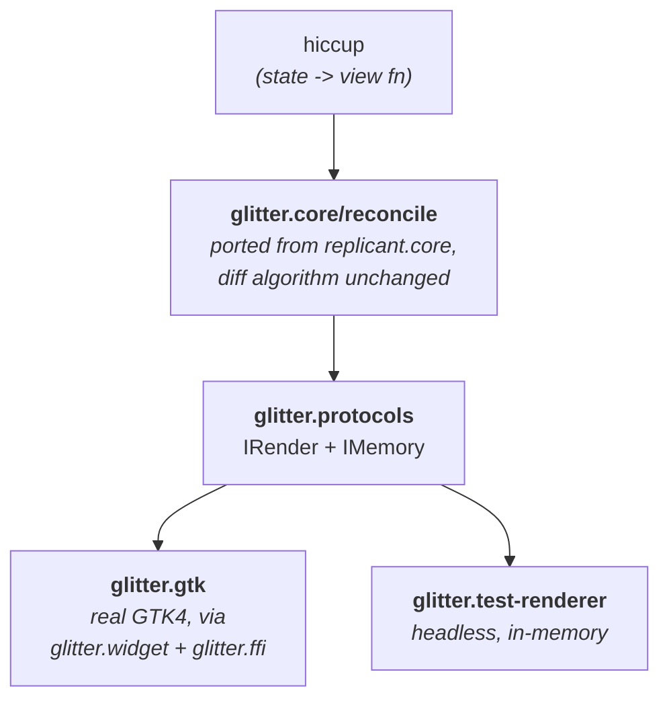

# glitter

A Replicant-style GTK4 renderer for [Jolt](https://github.com/jolt-lang/jolt).

Where [glimmer](https://github.com/jolt-lang/glimmer) applies
[Reagent](https://reagent-project.github.io/)'s model to GTK4 (ratoms,
automatic dependency tracking, component-local state), glitter applies
[Replicant](https://github.com/cjohansen/replicant)'s model: a single
application-state atom, a pure `state -> hiccup` view function, top-down
re-render on every state change, and data-driven action-dispatch event
handlers instead of closures. No component-local state anywhere.

**Documentation:** <https://jlt-commons.github.io/glitter/>

## Quick start

```clojure
(require '[glitter.app :as app]
         '[glitter.core :as core]
         '[glitter.gtk :as gtk])

(defonce state (atom {:count 0}))

(defn view [{:keys [count]}]
  [:box {:spacing 12}
   [:label {:label (str "Count: " count)}]
   [:button {:label "+ 1" :on {:click [[:action/inc]]}}]])

(core/set-dispatch!
 (fn [_event actions]
   (doseq [[kind] actions]
     (case kind :action/inc (swap! state update :count inc) nil))))

(app/run (fn [window] (gtk/mount! window view state)))
```

`jolt counter` is the full interactive demo. `jolt todo` is a larger
interactive task-board demo; derived counts, an entry with placeholder
text, checkbutton toggles, list rendering (ported from
[glimmer's `examples/glimmer/todo.clj`](https://github.com/jolt-lang/glimmer/blob/main/examples/glimmer/todo.clj),
contrasting glimmer's component-local ratom closures with glitter's one
state atom + data-driven action dispatch). `jolt crud` is a third
interactive demo; a port of the [7GUIs CRUD
task](https://eugenkiss.github.io/7guis/tasks/#crud): a live prefix
filter, `:list-box` single-selection (auto-populating two entry fields,
a design choice beyond the strict spec text), and `:sensitive`-gated
Create/Update/Delete buttons. `jolt flights` is a fourth interactive
demo; a port of the [7GUIs Flight
Booker task](https://eugenkiss.github.io/7guis/tasks/#flight-booker):
a date-constraint form (combobox, two date fields, a Book button)
dispatched entirely through `glitter.nexus`, a ported data-driven
action/effect/placeholder engine (see below). `jolt temperature` is a
fifth interactive demo; a port of the [7GUIs Temperature Converter
task](https://eugenkiss.github.io/7guis/tasks/#temp): two linked
`:entry` fields (Celsius, Fahrenheit) where editing one immediately
updates the other, a third, minimal `glitter.nexus` consumer. `jolt timer`
is a sixth interactive demo (a port of the [7GUIs Timer
task](https://eugenkiss.github.io/7guis/tasks/#timer): a duration slider,
an elapsed-time progress bar/label that advances on its own via a
background tick, and a Reset button) a fourth `glitter.nexus` consumer
and the first demo whose state changes without any user interaction.

As of this arc, `jolt todo`/`jolt crud`/`jolt flights`/`jolt temperature`/
`jolt timer` all dispatch through `glitter.nexus`; a port of
[nexus](https://github.com/cjohansen/nexus) (same author as Replicant)
that replaces a hand-written `execute-actions` `case` form with plain
data: actions dispatch through registered **effect** handlers (the only
functions allowed to mutate state), **placeholder** resolvers substitute
event-derived values into that data, and **action-expansions** are pure
`(state & args) -> more-actions` functions for interactions that need
to read current state before deciding what should happen. `jolt flights`
needs only effects and placeholders; `jolt crud`/`jolt todo`/
`jolt temperature`/`jolt timer` also use action-expansions. See
[`docs/guide/nexus.md`](docs/guide/nexus.md) for the full model,
including two live-verified date gotchas `jolt flights` turned up:
`t/parse-date` is lenient, so its date validation needs a round-trip
check, and `(t/today)` used to answer the UTC date rather than the
machine's — traced here and fixed upstream in `jolt-lang/time` v0.0.7,
which `deps.edn` pins.

Four **widget galleries** (`jolt gallery-inputs`, `gallery-layout`,
`gallery-display`, `gallery-chrome`) are runnable reference pages rather
than tasks: between them they use all 43 widget tags, each is written to be
copied from, and [`docs/guide/widgets.md`](docs/guide/widgets.md) — the
per-tag reference of props, signals and what `[:glitter/value]` resolves to
— quotes them directly.

`jolt test` runs the unit suite. The rest are 27 automated live-GTK
smokes, each of which mounts a real window and exits non-zero on failure.

<details>
<summary><strong>All 27 live-GTK smokes, and what each one pins</strong></summary>

| task | pins |
|---|---|
| `jolt smoke` | mount a tree and run the loop without an exception escaping |
| `jolt keyed` | keyed reorder lands in the right GTK order |
| `jolt replace-child` | a replaced child stays at its position, not the end |
| `jolt aliased` | aliases expand through the real renderer, on mount and update |
| `jolt main-thread-smoke` | an off-main-thread `swap!` renders ON the GTK main thread |
| `jolt scale-smoke` | `:scale`'s `value-changed` signal delivers the right double, no spurious dispatch on programmatic sync |
| `jolt class-smoke` | `:class` reaches real GTK CSS classes: add, coexist, and remove on a re-render diff |
| `jolt leaf-widgets-smoke` | `:spinner`/`:progress-bar`/`:image` construction + re-render land on real GTK state |
| `jolt toggle-level-smoke` | `:toggle-button`'s `toggled` signal delivers correctly (reused from `:checkbutton`), `:level-bar` construction + re-render |
| `jolt link-button-smoke` | `:link-button` reuses `:on-click`; a real click (via `gtk_widget_activate`) reaches dispatch |
| `jolt switch-smoke` | `:switch`'s `state-set` signal (3-arg, non-void return: a generalized callable shape) delivers correctly, no spurious dispatch |
| `jolt revealer-center-box-smoke` | `:revealer`'s props-driven reveal/transition; `:center-box`'s 3 named slots survive an append, a props-only update, and a removal |
| `jolt spin-button-list-box-smoke` | `:spin-button`'s `value-changed` reads back through the right getter despite sharing `:scale`'s signal name; `:list-box`'s `row-selected` (a third callable shape) delivers the selected row's index, and a tag-swapped/removed row doesn't corrupt its siblings or spuriously dispatch |
| `jolt password-search-entry-smoke` | `:password-entry`/`:search-entry` reuse `:entry`'s `GtkEditable`-delegate `changed` signal; `:search-entry`'s own `search-changed` fires synchronously on a text clear, no spurious dispatch on programmatic sync |
| `jolt expander-paned-smoke` | `:expander`'s `notify::expanded` and `:paned`'s `notify::position` deliver correctly: free reuse of the 3-arg-void callable shape `:list-box` generalized, and `:paned`'s 2 named slots survive a safe tag swap |
| `jolt aspect-frame-calendar-smoke` | `:aspect-frame`'s single-child container reuse; `:calendar`'s `GDateTime`-refcounted date round-trips through a real interaction and a programmatic sync with no leaks or spurious dispatch |
| `jolt overlay-flow-box-smoke` | `:overlay`'s 1-main+N-overlay shape survives a real removal, verified via a generic widget-tree walk since GTK exposes no overlay-enumeration API; `:flow-box`'s tag-swapped middle child lands correctly without corrupting siblings |
| `jolt picture-editable-label-smoke` | `:picture`'s display-only `GdkPaintable` props land on real GTK state; `:editable-label` (a third `GtkEditable`-delegate reuse) dispatches its typed value, no spurious dispatch on a programmatic `:editing` toggle |
| `jolt notebook-scale-button-smoke` | `:notebook`'s `switch-page` (a sixth callable shape, reading `page-num` from its own raw signal argument, not a stale getter) delivers correctly, including its real mount-time auto-select-page-0 dispatch; `:scale-button`'s `value-changed` (sharing `:scale`'s/`:spin-button`'s signal name but needing tag-aware dispatch) delivers the right double |
| `jolt inscription-search-bar-smoke` | `:inscription`'s display-only text/overflow props and `:search-bar`'s single-child `search-mode`/`show-close-button` props land on real GTK state, on mount and after a re-render |
| `jolt header-bar-action-bar-smoke` | `:header-bar`/`:action-bar`'s hybrid title/center-widget-plus-pack-start shape lands children in the right roles and order; the real `show-title-buttons` native-window-controls-prepend finding is asserted explicitly |
| `jolt menu-button-popover-smoke` | `:menu-button`'s popover-as-child relationship and `:popover`'s suppressing-guarded `visible` prop plus free-reuse `activate`/`closed` signals round-trip through a real click, a real close, and a programmatic sync in both directions with no spurious dispatch |
| `jolt ctor-apply-regression-smoke` | four real, previously-shipped bugs stay fixed: `:checkbutton`'s `label`, and `:scale`/`:scale-button`/`:spin-button`'s `min`/`max`/`step` no longer clobber each other across separate single-key re-renders |
| `jolt window-handle-stack-smoke` | `:window-handle`'s single-child wrap lands correctly; `:stack`'s mount-time auto-select-first-page dispatch, a real page switch, and a programmatic sync-back all work |
| `jolt drop-down-grid-smoke` | `:drop-down`'s `GtkStringList`-backed selection round-trips through a real interaction and a programmatic sync-back; `:grid`'s child-props-driven cell placement (including a column-span cell) lands at the right coordinates |
| `jolt list-box-reorder-smoke` | `list-box-reorder-child!`/`flow-box-reorder-child!`'s `g_object_ref_sink`/`g_object_unref` fix stays fixed: a keyed `:list-box` and a keyed `:flow-box` both survive a genuine reorder without the use-after-dispose crash found while building the CRUD demo |
| `jolt gallery-smoke` | all four widget galleries mount and round-trip through the real reconciler; pins the `:placeholder` fix on `:entry`/`:search-entry`, `:grid` cell placement from the child's own props, and the two mount-time dispatches GTK emits while populating a `:notebook` and a `:stack` |

</details>

**In CI, invoke the alias form, not the task form**: `jolt -M:test`,
`jolt -M:keyed`, and so on. Verified against jolt v0.6.3: a
deps.edn `:tasks` entry does not propagate its child process's exit status, so
`jolt test` reports failures on stdout and still exits 0, while `jolt -M:test`
correctly exits 1. The task shorthand is fine interactively; it cannot gate a
build.

### Or via `bb`

If you have [Babashka](https://babashka.org/) installed, `bb.edn` wraps the
same tasks with a grouped cheat-sheet:

```
bb info      # start here — grouped task list
bb test      # jolt -M:test
bb counter   # interactive demo
bb todo      # interactive task-board demo
bb crud      # interactive 7GUIs CRUD demo
bb flights   # interactive 7GUIs Flight Booker demo
bb temperature # interactive 7GUIs Temperature Converter demo
bb timer     # interactive 7GUIs Timer demo
bb smokes    # every live-GTK smoke in sequence, CI-safe (stops at first failure)
```

`bb.edn`'s tasks all shell out to the `-M:<alias>` form directly (never the
deps.edn `jolt <task>` shorthand), so `bb test` and `bb smokes` exit non-zero
on failure and are safe to use as a CI gate.

### Quality tooling

```
bb lint / lint:strict / lint:errors      # clj-kondo: report | propagate exit | errors-only
bb lsp:format / lsp:format-check          # reformat, or check formatting (dry run)
bb lsp:clean-ns / lsp:clean-ns-check      # organize ns forms, or check (dry run)
bb lsp:diagnostics / lsp:check / lsp:fix  # diagnostics | all dry-run checks | auto-fix
bb check:positional-args / :strict        # find fns with 3+ positional args
bb verify                                 # pre-commit gate: lint (report) + test (must pass)
bb hooks:install / :install:full / :uninstall  # git pre-commit hook: fast | +tests | remove
bb site:build / site:serve [port] / site:clean # local preview of the docs site
```

`clj-kondo`/`clojure-lsp` both need `.clj-kondo/hooks/jolt_ffi.clj` (an
`analyze-call` hook rewriting `jolt.ffi/defcfn` into an equivalent `defn`,
adapted from [b12n-raylib-jlt](https://github.com/jlt-commons/raylib-jlt)) to see
through the FFI-binding macro: without it every `gtk-*`/`g-*` name in
`glitter.ffi` and every call site through the `g/` alias reports as
unresolved. `.clj-kondo/config.edn`'s `:output {:exclude-files [...]}`
excludes the files ported verbatim from Replicant (they keep intentional
`#?(:clj :cljs)` reader conditionals in a `.clj` extension: a permanent,
harmless false positive for that specific porting strategy, not a real
defect), so `bb lint` and friends run unscoped over `src test examples`.
`bb hooks:install` sets up a fast pre-commit hook (lint errors + format +
ns cleanliness) that gates every commit on staying `bb lsp:format-check`-
clean (the whole codebase is formatted uniformly now, including the
files ported from Replicant (an earlier decision to exempt those from
clojure-lsp's default style, to preserve upstream diffability, was later
reversed in favor of one uniform style project-wide)) see
`docs/guide/testing-and-tasks.md` for the full rationale on both.

## Architecture



`glitter.core` drives *when*: it diffs old hiccup against new and calls
`IRender`/`IMemory` methods. It has no idea GTK exists, which is what makes
two backends possible from one reconciler: real widgets for an app, an
in-memory fake for headless tests.

Where the code came from:

- `glitter.core`, `glitter.protocols`, `glitter.hiccup*`, `glitter.vdom`,
  `glitter.alias`, `glitter.errors`, `glitter.assert*`, `glitter.console-logger`
 ; ported from [Replicant](https://github.com/cjohansen/replicant) (MIT,
  Christian Johansen). See `NOTICE`.
- `glitter.ffi`, `glitter.widget`, `glitter.genum`: forked from
  [glimmer](https://github.com/jolt-lang/glimmer). `glitter.app` is adapted
  from the non-reactive app-loop slice of `glimmer.core`.
- `glitter.gtk`, `glitter.test-renderer`, `glitter.env`: new code specific
  to glitter.

## Documentation

- **[`docs/guide/index.md`](docs/guide/index.md)**, the full guide: the
  reconcile → `IRender`/`IMemory` architecture, the GTK4-specific widget/
  signal-lifecycle mechanics, cross-thread marshalling, the porting/
  attribution ledger, testing, and every known v1 limitation in depth.
- **[`CONTRIBUTING.md`](CONTRIBUTING.md)** (how to set up, which gates to
  run before a PR, how to add a widget, and the numbered list of invariants
  not to regress (each one was a real bug at some point).
- **[`NOTICE`](NOTICE)**) file-by-file provenance for everything ported from
  Replicant, forked from glimmer, or ported from nexus.
- Design spec and implementation plan are not part of this repo; they live in
  a private planning store.

## Status

**Early.** 43 widget tags, plus `:hbox`/`:vbox` sugar for an oriented
`:box`. Nine of them came across in the original fork from
[glimmer](https://github.com/jolt-lang/glimmer); the rest were added
directly to glitter.

| Group | Tags |
|---|---|
| From the glimmer fork | `window` `box` `button` `label` `entry` `checkbutton` `separator` `frame` `scrolled` |
| Display-only | `:spinner` `:progress-bar` `:image` `:level-bar` `:picture` `:inscription` |
| Buttons and toggles | `:toggle-button` `:link-button` `:switch` `:menu-button` |
| Text entry | `:password-entry` `:search-entry` `:editable-label` `:search-bar` |
| Values and selection | `:scale` `:spin-button` `:scale-button` `:calendar` `:drop-down` |
| Containers | `:revealer` `:center-box` `:paned` `:overlay` `:aspect-frame` `:expander` `:window-handle` |
| Multi-child / layout | `:list-box` `:flow-box` `:grid` `:stack` `:notebook` |
| Chrome and popups | `:header-bar` `:action-bar` `:popover` |

Hiccup `:class` reaches real GTK CSS classes via
`gtk_widget_add/remove_css_class`, so GTK4's built-ins (`"flat"`,
`"suggested-action"`, `"destructive-action"`, `"pill"`) work with zero
app-provided CSS.

`:style` does not. GTK4 has no DOM-`style`-attribute equivalent, only
class-based styling, so an inline `:style` prop has no GTK call to wire
to. There are no animated mount/unmount transitions yet either.

Where each file came from is recorded per-file in [`NOTICE`](NOTICE).

<details>
<summary><strong>How the widget layer got here: the findings behind each round</strong></summary>

The short version of `docs/guide/gtk-widget-layer.md`, which has the full
trace for every widget. Most tags were free reuses of machinery that
already existed; these are the ones that were not.

**Non-standard GTK signals.** Almost every GTK signal glitter connects is
`void(widget, user_data)`: `glitter.gtk/set-event-handler` builds that
shape by default. `GtkSwitch`'s real interaction signal, `"state-set"`, is
`gboolean(GtkSwitch*, gboolean, gpointer)`: 3 args, non-void return.
`GtkListBox`'s `"row-selected"`/`"row-activated"` are
`void(GtkListBox*, GtkListBoxRow*, gpointer)`: 3 args, VOID return, a
THIRD distinct shape. Both confirmed by reading the relevant `g_signal_new`
call directly, not assumed. `jolt.ffi/foreign-callable`'s
`argtypes`/`rettype` must be compile-time literals (verified live that a
let-bound local, even holding the exact same value, throws a compile
error), so `set-event-handler` branches explicitly on the GTK signal name
and uses a separate, literal `foreign-callable` call per non-standard
shape: there's no data-driven way to add one; it needs its own literal
branch. See `docs/guide/gtk-widget-layer.md` for the full story, including
the design that was tried first and didn't work.

**`signal-value` keyed by `[tag signal]`, not bare signal name.**
`:spin-button` (`GtkSpinButton`) emits `"value-changed"` (the exact same
GTK signal name `:scale` (`GtkScale`/`GtkRange`) already uses), but needs
a different getter to read the value back. A table keyed by bare signal
name would have one widget's registration silently clobber the other's;
found live, before it ever shipped and broke `:scale`. See
`docs/guide/gtk-widget-layer.md`.

**`:center-box`'s 3 fixed named slots vs. `glitter.gtk`'s generic child
bookkeeping.** Known v1 gap, found live: do not swap a slot's hiccup tag
(e.g. `:label` -> `:button`) while all 3 slots are occupied: the
reconciler handles a same-position tag mismatch as "insert new, then
remove old," and unlike `:box`'s arbitrary-capacity list, GtkCenterBox has
no room for a transient 4th occupant, so the mismatch between glitter's
generic bookkeeping and GtkCenterBox's real capacity can corrupt an
unrelated third slot. `:list-box` does not share this problem. This same
investigation also caught and fixed a real bug: `insert-child-after!`/
`reorder-child!` were originally left as no-ops for any container besides
`:box`: wrong, not just incomplete, since even a plain non-keyed tag
swap goes through them. Both are now properly implemented for
`:list-box`; `:center-box` gets `insert-child-after!` but not
`reorder-child!` (a genuinely structural no-op: three named slots have
no meaningful "reorder"). See `docs/guide/gtk-widget-layer.md`.

**`:password-entry`/`:search-entry` reuse `:entry`'s `GtkEditable`
signal for free, but `signal-value` still needed new entries.** Both
implement `GtkEditable` via a delegate (confirmed against
`gtk/gtkpasswordentry.c`/`gtk/gtksearchentry.c`), so `"changed"` and
`gtk_editable_set/get_text` work on either pointer with no new plumbing.
`signal-value`'s `[tag signal]` keying (above) meant `:entry`'s own
registration didn't automatically cover them, though: the first version
of this round shipped without `[:password-entry "changed"]`, silently
losing the dispatched value. `:search-entry` also gets a genuinely new
`"search-changed"` signal, debounced except when clearing to empty text
(fires synchronously: confirmed by reading `gtk_search_entry_changed`'s
C body).

**`:expander`/`:paned` reuse the 3-arg-void shape for free; `:paned`
inherits `:center-box`'s gap with a different failure shape.** Neither
widget has a dedicated interaction signal: real interactivity is
`"notify::expanded"`/`"notify::position"`, GObject property-change
signals that share the exact `void(GObject*, GParamSpec*, gpointer)`
shape `:list-box` already generalized `set-event-handler` for, so no new
literal call site was needed. `:paned` is a new 2-named-slot container
(a simpler `:center-box`), inheriting the same structural v1 gap but
verified to fail DIFFERENTLY: swapping the last slot's tag while both
are full lands correctly (no trailing slot to corrupt into); swapping
the first slot's tag silently drops the new widget and leaves that slot
empty. See `docs/guide/gtk-widget-layer.md` for both traces.

**`:aspect-frame` (quick win) and `:calendar` (a genuinely new value
type).** `:aspect-frame` reuses `:frame`'s single-child container
strategy verbatim: only its own xalign/yalign/ratio/obey-child
construction params are new, and being plain floats/bool they carry no
GType-registration risk. `:calendar`'s `"day-selected"` is the standard
2-arg-void shape, but `gtk_calendar_get_date` returns a `GDateTime*`:
this project's first refcounted GLib value type. Confirmed by reading
`gtk_calendar_get_date`'s C body directly that it calls `g_date_time_ref`
internally, so every read/construct site must `g_date_time_unref` what
it refs, or every render/dispatch leaks one `GDateTime` object.

**`:overlay`: a third, genuinely different container shape, and
`:flow-box`, a `:list-box` sibling with a verified DIFFERENCE, not an
assumed similarity.** `GtkOverlay` has exactly one queryable slot (the
main content) plus an unbounded set of floating overlay children with NO
enumeration getter at all: unlike `:center-box`/`:paned`, overlay
occupancy can't be queried live; the first hiccup child becomes main,
every later child becomes an overlay. It inherits the same class of
structural gap as `:center-box`/`:paned` for its one named slot.
`:flow-box` auto-wraps children the identical way `:list-box` does, but
`gtk_flow_box_remove` does NOT share `gtk_list_box_remove`'s gotcha:
its C body explicitly accepts either the wrapped child or the plain
widget, confirmed by reading it directly rather than assuming the
lesson transfers between sibling widgets. See
`docs/guide/gtk-widget-layer.md` for both write-ups.

**`:picture` (quick win) and `:editable-label` (a third `GtkEditable`
delegate, and a general finding).** `:picture` is display-only (no
`g_signal_new` in `gtk/gtkpicture.c`) a modernized `:image` with real
aspect-ratio-aware scaling via `:content-fit`. `:editable-label`
implements `GtkEditable` via a delegate, like `:password-entry`/
`:search-entry` before it, reusing `"changed"` for free, but repeated
the exact `[:password-entry "changed"]` near-miss from two rounds ago:
a comment said its own `signal-value` entry would be "applied
proactively this time," and it was still missed on the first pass,
caught only by live probe testing. Investigating it surfaced a real,
general `GtkEditable` finding, not specific to this widget:
`gtk_editable_set_text` is delete-then-insert, two separate mutations:
replacing already-empty text fires `"changed"` once, replacing
non-empty text fires it twice. Affects `:entry`/`:password-entry`/
`:search-entry`/`:editable-label` alike.

**`:notebook`; a sixth callable shape, a real mount-time dispatch, and
`:scale-button`; the first tag-aware signal dispatch.** `:notebook`'s
`"switch-page"` is `void(GtkNotebook*, GtkWidget*, guint, gpointer)`; 4
args, and the FIRST signal here that can't reuse the shared
re-read-via-getter path: the getter's own update happens in the
signal's default class handler, which runs AFTER glitter's, so the
value-fn reads `page-num` straight from its own raw signal argument
instead: verified both by reading the C source and by an empirical
probe comparing the raw value against a same-tick (stale) getter read.
Separately, GTK auto-selects the first page added to an empty
notebook (confirmed by reading `gtk_notebook_insert_page`'s C body),
so mounting a `:notebook` with initial children genuinely dispatches a
`"switch-page"` action as a mount-time side effect, before any real
interaction. `:scale-button` is a THIRD widget sharing `:scale`'s/
`:spin-button`'s exact `"value-changed"` signal name, with a genuinely
different C shape (`void(GtkScaleButton*, double, gpointer)`): the
first case where `set-event-handler` has to check the widget's own tag,
not just the signal name, to pick the right callable. Verified SAFE to
still re-read via the usual getter, unlike `:notebook`'s signal. See
`docs/guide/gtk-widget-layer.md` for both write-ups.

**`:inscription`/`:search-bar` (zero `glitter.gtk` changes), `:header-bar`/
`:action-bar` (a genuinely new hybrid container), and `:menu-button`/
`:popover` (the first popup surface).** `:inscription`/`:search-bar` are
entirely display/props-driven, no signal: the first round needing no
`glitter.gtk` changes at all. `:header-bar`/`:action-bar` are a hybrid
shape: one named title/center-widget slot plus an ORDERED pack-start
list. Confirmed by reading `gtk_header_bar_pack`'s C body directly:
`pack_start` safely appends, but `pack_end` prepends (silently
reversing hiccup order if fed one child at a time) confirmed
independently for `gtk_action_bar_pack_end` too rather than assumed to
carry over; v1 only wires `pack_start` on either widget. A second real
finding, caught live while writing the smoke: toggling
`:show-title-buttons` prepends GTK's own native window-controls widget
into the SAME pack-start region glitter's children live in: asserted
explicitly, not avoided. `:menu-button`'s ONE hiccup child, if present,
is attached via `gtk_menu_button_set_popover` (confirmed real
parenting, not a passive reference) rather than any existing
container-management branch: the first hiccup relationship that isn't
a normal tree child. Both `:on-activate` and `:on-closed` turned out to
be free reuses of the default 2-arg-void shape. `:popover`'s `:visible`
prop is a controlled-component contract identical to `:notebook`'s
`:current-page`: `:menu-button`'s own click handling opens the popover
independently of glitter, so an app syncs its own state via
`:on-activate`/`:on-closed`. See `docs/guide/gtk-widget-layer.md` for
all three write-ups.

**A ctor/apply audit that found four real bugs, a namespaced-props
finding, and the new `:glitter/structural-props` mechanism `:grid`/
`:stack` need.** A probe confirmed `:ctor`'s `props` argument is
ALWAYS empty at the real call site: `glitter.core` only ever passes
an optional namespace hint, never the hiccup attrs; real props arrive
afterward, one key per `IRender/set-attribute` call. Auditing all 39
pre-round-11 widget specs against this found four real, previously-
shipped bugs, invisible to every existing smoke: `:checkbutton`'s
`:label` was never applied at all; `:scale-button`'s `:min`/`:max`/
`:step` had the same gap; and `:scale`/`:spin-button`'s `:min`/`:max`
silently clobbered each other across separate single-key re-renders
(confirmed live that this fires even at initial mount). All three
fixed by reading the widget's OWN current value as the fallback
instead of a hardcoded default. A fourth instance, `:window`'s
`:width`/`:height`, was found but left unfixed (its getter needs
OUT-PARAMETER FFI marshalling, a new complexity class). Designing
`:grid` also surfaced that a NAMESPACED keyword prop (`:grid/column`)
is silently dropped by `glitter.core` itself, upstream of every
backend, so `:grid`/`:stack`'s own structural props use plain,
hyphenated keys instead. `:window-handle` is a quick single-child win
whose first live run caught a bug in this round's own new code (a
missing case branch, silently no-child). `:stack` is a `:notebook`
sibling with NAME-addressed pages: a THIRD instance of the
mount-time-auto-dispatch finding, plus a real `:apply`-timing gap
(an initial non-default page doesn't take effect at mount).
`:drop-down` is the first "choose from options" widget, built on an
incrementally-constructed `GtkStringList`, with both signals free
reuses of shapes already generalized elsewhere. `:grid` needed real
architecture: `gtk_grid_attach`'s cell position is data the CHILD's
hiccup props carry, not something the child's own `:apply` could ever
know: `glitter.gtk/set-attribute`/`remove-attribute` now stash
matching props on the CHILD's own tracking atom under
`:glitter/structural-props`, threaded through to `glitter.widget`'s
container-management functions as a new optional argument. **Known
v1 constraint**: structural props are read only at first attach, not
reactive to later re-renders. See `docs/guide/gtk-widget-layer.md`
for the full write-up.

**A `GtkViewport` auto-wrap finding, and a real use-after-dispose bug
(both found building `examples/glitter/crud.clj`.** `:scrolled`, forked
in round 1, had never been given real content before this port) its
child, if it doesn't implement `GtkScrollable` (`:list-box` doesn't),
gets silently wrapped by GTK itself in a hidden `GtkViewport`
(confirmed via `gtk_scrolled_window_set_child`'s own doc comment and
body). Separately, a genuine bug: `list-box-reorder-child!`/
`flow-box-reorder-child!` were reusing a widget pointer GTK had
already disposed (`gtk_list_box_remove`/`gtk_flow_box_remove` dispose
the now-unreferenced wrapping row/child, whose own `dispose` handler
unparents (and finalizes) ITS child too (confirmed by reading
`gtk_list_box_row_dispose`'s/`gtk_flow_box_child_dispose`'s C bodies
directly)) the exact keyed-reorder path `docs/guide/limitations.md`
had flagged as implemented but not previously live-verified. Fixed via
a `g_object_ref_sink`/`g_object_unref` bracket around the
remove-then-reinsert in both functions. See
`docs/guide/gtk-widget-layer.md` for both write-ups.

Known v1 limitations:

</details>

### Known v1 limitations

Each one is a deliberate scope call with the reasoning recorded in
[`limitations.md`](docs/guide/limitations.md), not an oversight.

<details>
<summary><strong>All known v1 limitations</strong></summary>

- **Removing an attribute entirely is a no-op.** Setting one to a new value
  always works, including an explicit `false`, but GTK has no generic "unset
  this property" the way `removeAttribute` does in the DOM, so dropping a key
  from your hiccup leaves the widget's last value in place. A real fix needs
  per-widget-type defaults in `glitter.widget`'s `:apply` closures.
- **`mount!` is one-way.** It registers its watcher under a fixed key and
  returns `nil`, so there is no unmount, and mounting twice against the same
  state atom silently replaces the first watcher rather than running both.
- **`IMemory` never releases.** `:glitter/remember` data is held in a
  process-global map keyed by element, with no eviction on unmount. Fine for
  the intended use (a value stashed on mount, read on update); don't lean on
  it for anything long-lived or high-cardinality. Replicant's DOM backend
  uses a `WeakMap` here; there is no equivalent yet.
- **`:center-box` cannot safely swap a slot's hiccup tag while all 3 slots
  are occupied.** Change props instead of tags, or nest a stable wrapper
  tag one level down so the type change happens where `:box`-shaped
  reconciliation already handles it correctly.
- **`:paned` cannot safely swap a slot's hiccup tag while both slots are
  occupied either**; same remedy, but the failure shape differs:
  swapping the last slot lands correctly, swapping the first silently
  drops the new widget and leaves that slot empty.
- **`:overlay` cannot safely swap the main child's hiccup tag once
  occupied either**: same class of gap, and GTK exposes no way to
  enumerate overlay children at all, so this is unverifiable by a live
  smoke beyond the append/remove/replace path that's already covered.
- **`:flow-box`'s `:on-child-activated` carries no `:glitter/value`.**
  Reading back "which child" would need `GList` marshalling via
  `gtk_flow_box_get_selected_children`: a new FFI complexity class
  deliberately deferred.
- **`:notebook` always passes a `NULL` tab label.** GTK auto-generates
  a default numbered tab; there's no v1 hiccup convention for a custom
  tab label per page yet.
- **Mounting a `:notebook` with pre-populated pages dispatches once,
  before any real interaction.** GTK auto-selects the first page added
  to an empty notebook, firing `"switch-page"` as a side effect of
  construction: real GTK behavior, but a dispatch-count baseline of 0
  right after mount is wrong for `:notebook`.
- **Bulk `GtkEditable` text replacement can fire `"changed"` once or
  twice**, depending on whether the buffer started empty: affects
  `:entry`/`:password-entry`/`:search-entry`/`:editable-label` alike;
  only matters for a programmatic bulk replace via
  `gtk_editable_set_text`, not normal typing.
- **`:header-bar`/`:action-bar` cannot safely swap the title/center-widget's
  hiccup tag while occupied**: same class of gap as `:center-box`/
  `:paned`/`:overlay`.
- **`:header-bar`/`:action-bar` never call `pack_end`** (both
  reverse-accumulate, confirmed via their C bodies) and can't reorder
  their pack-start region either (a real ordered list, but a private
  `GtkBox` glitter has no pointer to).
- **`:header-bar`'s `:show-title-buttons` shares glitter's own
  pack-start list** with GTK's own native window-controls widget,
  prepended when toggled true: real GTK behavior, asserted explicitly
  rather than avoided.
- **`:search-bar` cannot auto-manage search mode via key capture**:
  `gtk_search_bar_connect_entry`/`set_key_capture_widget` both need a
  raw widget pointer glitter has no hiccup-level convention for passing
  sideways yet; `:search-mode` remains fully controllable
  programmatically.
- **`:grid`/`:stack`'s structural child props are read only at first
  attach.** A later re-render's changed `:grid-column`/`:grid-row`/
  `:stack-name` doesn't move a grid cell or rename a stack page.
- **`:stack` doesn't honor a non-default initial `:visible-child-name`
  at mount**: `:apply` runs before the reconciler appends children, so
  GTK's own auto-select-first-page wins instead; later re-renders work
  correctly.
- **`:window`'s `:width`/`:height` can clobber each other across
  separate single-key re-renders**: the same shape `:scale`'s/
  `:spin-button`'s `:min`/`:max` had, not fixed the same way because
  the getter needs OUT-PARAMETER FFI marshalling; practical impact is
  narrow (initial-sizing-only).

</details>
