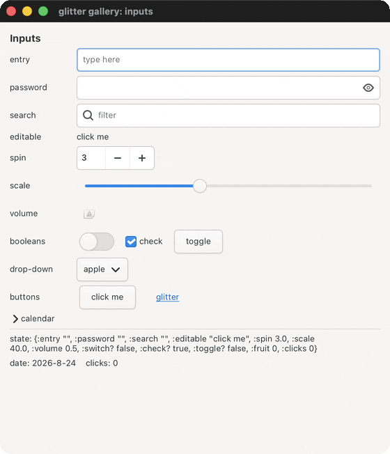
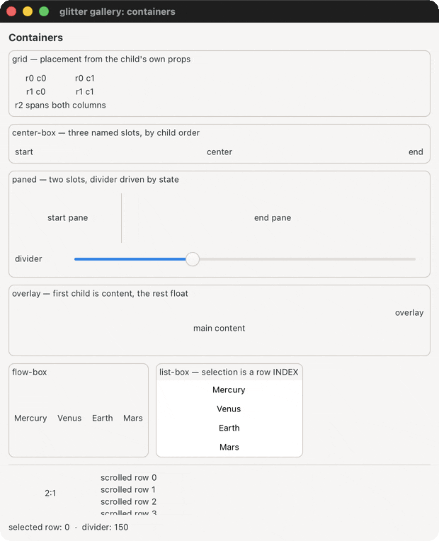
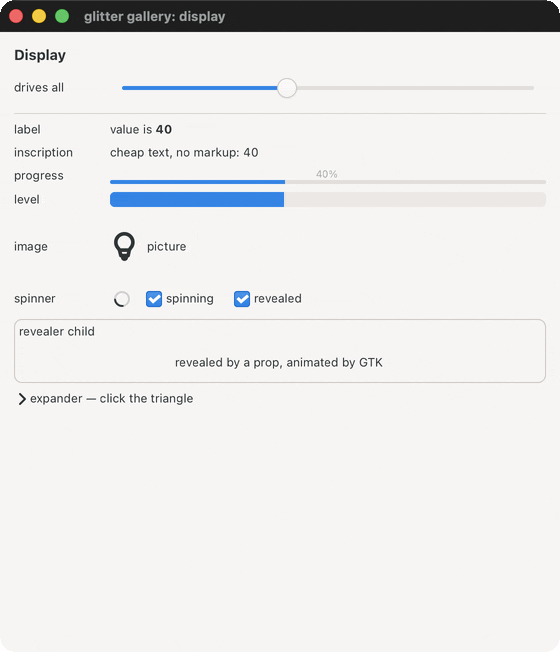
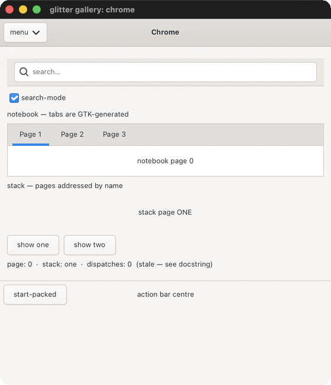

# Demos

Animated previews of glitter's interactive demos. Regenerate with `bb record` (maintainer-only: it needs an internal capture tool that is not publicly released). The GIFs here are committed, so you do not need it to browse them.

## basics

### counter

state atom + action dispatch, the whole model in 20 lines

### todo

checkbutton toggles driving derived counts

## 7GUIs tasks

### crud

live prefix filter, list-box selection, create/update/delete

### flights

constraints between widgets and within one

### temperature

two linked fields, each updating the other

### timer

elapsed time that advances on its own, plus Reset

## widget gallery

### gallery-inputs

every value-bearing widget, all writing into one state atom

### gallery-layout

the containers, and how each decides where a child goes

### gallery-display

the read-only widgets, all driven by one value

### gallery-chrome

header/action bars, menu+popover, notebook, stack, search bar

