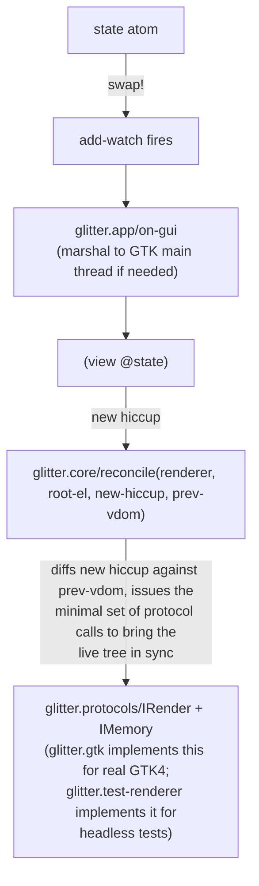

# Architecture

## The shape of a render



`glitter.core` (ported from `replicant.core`, see
[`porting-and-attribution.md`](porting-and-attribution.md)) is the entire
diff algorithm. It knows nothing about GTK — every effect it wants to have
on the live tree goes through the `IRender`/`IMemory` protocols in
`glitter.protocols`. This is the seam that makes two different backends
(`glitter.gtk` for real widgets, `glitter.test-renderer` for headless unit
tests) possible from the same reconciler.

## Composing views: plain function calls, not hiccup tags

glimmer/Reagent hiccup recognizes a function value in tag position —
`[my-component args...]` — and calls it, recursively rendering whatever it
returns. glitter's hiccup, ported from Replicant, does not: `glitter.hiccup/
hiccup?` requires a literal *keyword* in position 0
(`(and (vector? sexp) (keyword? (first sexp)))`). A vector whose first
element is a function value fails that check, so it isn't recognized as an
element to expand at all — it falls through to being treated as an opaque
child *value*, which `glitter.gtk`'s `create-text-node` then stringifies
with `str`. The failure is silent and easy to miss: no exception, just a
child that renders as literal text like `[#object[my_ns$my_component
0x1234 "..."] arg1 arg2]` instead of the intended widget tree.

**The fix is to call the helper as an ordinary function, splicing its
return value directly into the parent vector**: `(my-component args...)`,
not `[my-component args...]`. Since a glitter view is just a pure function
returning data, this works exactly like any other Clojure code — no
special hiccup convention needed for an in-file layout helper.

Replicant's *real* reusable-component mechanism is
[`glitter.alias`](porting-and-attribution.md): `defalias` registers a
function under a **qualified keyword**, and `[my-ns/my-component args...]`
in hiccup — a vector whose first element genuinely *is* a keyword — is
recognized and expanded via that registry (`glitter.alias/alias-hiccup?`
checks `qualified-keyword?`, not `fn?`). Reach for `defalias` when a
fragment needs to be referenced by a stable name across files or
registered once for reuse throughout an app; use a plain function call for
an ordinary same-file layout helper. `examples/glitter/aliased.clj`
exercises the alias path; `examples/glitter/todo.clj`'s `stat-card`/
`task-row` are the plain-function-call case (and were the live bug that
surfaced this distinction — see `AGENTS.md`'s conventions list).

## `mount!` — the state-atom watcher

`glitter.gtk/mount!` is Replicant's `state-atom.md` pattern, adapted from
`document.body` to a GTK root window:

```clojure
(defn mount!
  [window view state-atom]
  (let [r (renderer)
        root-el (atom {:tag :window :widget window :children [] :handlers {}})
        vdom (atom nil)
        render! (fn [state]
                  (reset! vdom (:vdom (core/reconcile r root-el (view state) @vdom
                                                      {:aliases (alias/get-registered-aliases)}))))]
    (render! @state-atom)
    (add-watch state-atom ::render (fn [_ _ _ state] (app/on-gui (fn [] (render! state)))))
    nil))
```

Three things worth noting:

1. **The root element is `window` itself**, tagged `:window` — GTK windows
   are single-child containers (`gtk_window_set_child`), so the mounted
   `[:box ...]` (or whatever the view returns) becomes window's *one*
   child, not window's replacement. `glitter.widget/append-child!`/
   `remove-child!`/`replace-child!` all branch on `container-kind`, and
   `:window` routes to `gtk_window_set_child`.
2. **Every re-render goes through `app/on-gui`**, not called directly. A
   `swap!` on `state-atom` can originate from any thread (an nREPL eval's
   worker thread, a `future`) — `on-gui` is what makes that safe. See
   [`app-loop-and-threading.md`](app-loop-and-threading.md).
3. **Registered aliases are merged into every reconcile call
   automatically** via `{:aliases (alias/get-registered-aliases)}` — an
   application never has to pass its alias registry through by hand.

## Why elements are atoms, not raw GTK pointers

GTK4 has no O(1) indexed-child-lookup API —
`gtk_widget_get_first_child`/`gtk_widget_get_next_sibling` is an O(n) walk
from the start of a container's child list. `glitter.core`'s reconciler,
however, expects to be able to hold an opaque "el" value per node and use
it as a stable identity across renders (for `IMemory`'s `remember`/`recall`,
for computing keyed-list diffs, and so on).

So `glitter.gtk`'s `IRender/create-element` and `create-text-node` don't
return the widget pointer directly — they return a Clojure atom:

```clojure
{:tag <hiccup tag keyword>
 :widget <GTK widget pointer>
 :children [<child atom> ...]
 :handlers {<event keyword> {:id <signal connection id> :cb <retained foreign-callable>}}}
```

- `:widget` is the actual GTK pointer, retrieved via the private `ptr` helper
  whenever a real FFI call needs it.
- `:children` is glitter's own ordered bookkeeping of this element's
  children (as `el` atoms), maintained by every `IRender` method that
  mutates the tree (`append-child`, `remove-child`, `insert-before`,
  `replace-child`, `remove-all-children`). This is what
  `insert-before` consults to tell a fresh insertion apart from a keyed
  reorder — see [`gtk-widget-layer.md`](gtk-widget-layer.md).
- `:handlers` tracks each connected GTK signal's connection id *and* its
  retained `foreign-callable`, so `set-event-handler`/`remove-event-handler`
  can cleanly disconnect and release exactly the right one later.
- `:glitter/structural-props` (round 11) holds a handful of props a CHILD
  carries for its PARENT to consume — `:grid-column`/`:grid-row`/
  `:grid-column-span`/`:grid-row-span` (`:grid`) and `:stack-name`
  (`:stack`) — stashed here by `set-attribute` instead of being routed to
  the child's own `:apply` closure, since no widget's `:apply` has any
  idea what "which grid cell am I in" would mean for itself. See
  [`gtk-widget-layer.md`](gtk-widget-layer.md) for the full mechanism and
  why these props must be plain, non-namespaced keywords.

## `:ctor`'s `props` argument is always empty — verified live, round 11

A fact easy to assume wrong by reading `glitter.widget`'s widget specs in
isolation: **`:ctor` never actually receives the real hiccup props at the
real call site.** `glitter.core`'s `create-node` calls
`IRender/create-element` with only an optional XML-namespace hint —

```clojure
;; glitter.core.clj — create-node's actual call, confirmed by reading it
(r/create-element renderer tag-name (when ns {:ns ns}))
```

— so `glitter.gtk`'s `create-element` always invokes a spec's `:ctor` with
`{}` or `{:ns "..."}`, never `{:label "..."}` or anything resembling a
real prop. Confirmed live, not assumed: a throwaway probe mounting
`[:button {:label "x"}]` printed `options` as `nil` at the real call
site, and the button's own label — read back immediately after
`w/create!` ran — was still empty.

The REAL prop values arrive afterward, through a completely different
path: `glitter.core`'s `set-attributes` calls `IRender/set-attribute`
once **per key**, not as one batched map:

```clojure
;; glitter.gtk.clj — set-attribute's actual body
(set-attribute [_ el a v _opt]
  (w/apply-props! (:tag @el) (ptr el) {(keyword a) v})
  nil)
```

Two consequences every widget-spec author needs to know:

1. A `:ctor` closure that branches on a prop (`(if (:label p) ...)`) is
   harmless *only if* `:apply` also independently re-applies that same
   prop — the `:ctor` branch never actually fires through the real
   reconciler flow, so the observable end state depends entirely on
   `:apply`. If `:apply` doesn't cover it, the prop silently never takes
   effect, ever. This shipped as a real bug in `:checkbutton-spec`'s
   `:label` and `:scale-button-spec`'s `:min`/`:max`/`:step` for 10
   rounds before being caught and fixed in round 11 — see
   [`gtk-widget-layer.md`](gtk-widget-layer.md) for the full trace.

2. An `:apply` closure that combines **multiple keys** into one native
   call, using a hardcoded fallback for whichever key is absent (`(or
   (:min p) 0)`), silently clobbers that key's real value whenever a
   render changes only ONE of the group — because `set-attribute`
   delivers exactly one changed key per call, a lone `:max` change
   genuinely arrives as `{:max 80}` alone, with no `:min` present to
   read. The fix is reading the widget's OWN current value as the
   fallback (via a GTK getter) instead of a hardcoded default — also
   shipped as a real bug in `:scale-spec`'s and `:spin-button-spec`'s
   `:min`/`:max` handling, masked for 10 rounds because every existing
   smoke's chosen test values happened to match the broken fallback.

`IMemory` (`remember`/`recall`, glitter's equivalent of Replicant's
per-element scratch storage — used for e.g. stashing a value on mount and
reading it back on update) keys off the `el` atom itself, not the raw
pointer — an atom is already a stable Clojure identity, which sidesteps any
question of whether Jolt FFI pointers hash/compare correctly as map keys.

## Event dispatch: data, not closures

A hiccup handler in glitter is data — `[:button {:on {:click
[[:action/inc]]}}]` — dispatched through one global function registered via
`core/set-dispatch!`:

```clojure
(core/set-dispatch!
 (fn [event actions]
   (doseq [[kind & args] actions]
     (case kind ...))))
```

`glitter.core/get-event-handler` wraps the raw action data in a function
that, when the underlying GTK signal fires, calls `(*dispatch* event-map
actions)` — `event-map` is built by `build-event-map`, which (on the `:clj`
side) reads the acting element out of `(:glitter/node e)` rather than a DOM
`event.target` (**deviation #1** from the pure Replicant port — see
[`porting-and-attribution.md`](porting-and-attribution.md)).

Because the handler is just data, it can change between renders (the same
button's `:on {:click [...]}` can carry different action tuples across two
renders) without the *signal itself* needing to change. `glitter.core`'s
diff still calls `IRender/set-event-handler` again whenever that data
changes — which is exactly why `glitter.gtk` has to manage GTK signal
connect/disconnect itself instead of connecting once at widget-creation
time. Full mechanics: [`gtk-widget-layer.md`](gtk-widget-layer.md).
