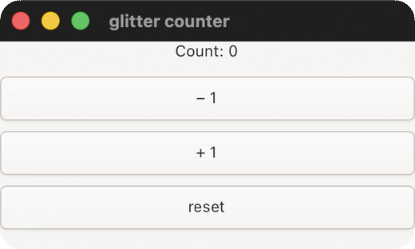
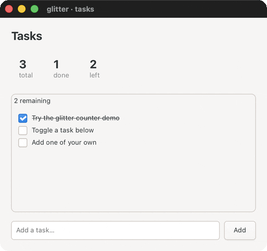
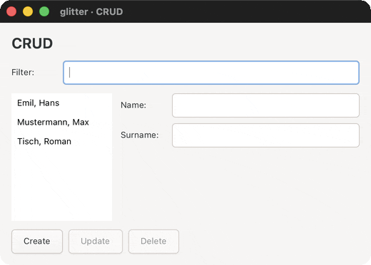
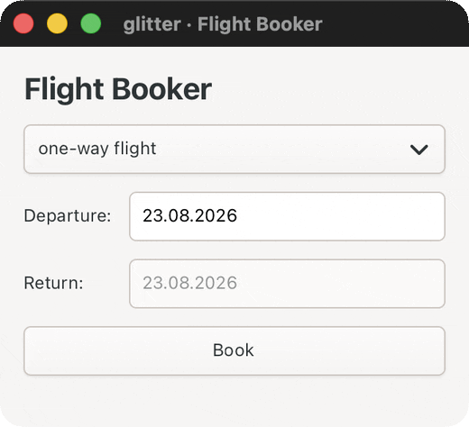
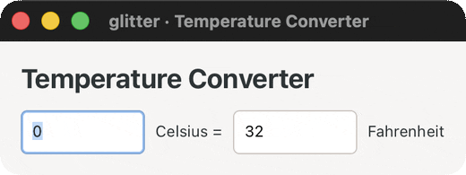
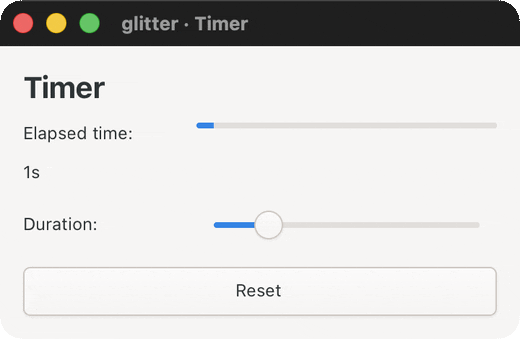

# The examples

Everything runnable lives under `examples/glitter/`; 32 namespaces, in two
kinds:

- **Six interactive demos** you open and click. Four of them are
  [7GUIs](https://eugenkiss.github.io/7guis/) tasks, so they can be
  compared against implementations in other toolkits.
- **Twenty-six live-GTK smokes** that mount a real window, assert against
  real GTK state, and exit non-zero on failure. These are the project's
  actual regression suite for the GTK layer; the headless unit suite
  can't reach it.

Run any of them with `bb <name>`, or `jolt -M:<name>` without babashka.
`bb info` prints the same grouping live.

## Interactive demos

| preview | `bb` name | Task | What it demonstrates |
|---|---|---|---|
|  | `counter` | — | The canonical demo. One state atom, a pure `state -> hiccup` view, handlers as data. The 20-line version of the whole model. |
|  | `todo` | — | A task board: derived counts computed inline (glitter has no reactive-derivation primitive, the view just re-runs), an entry with `:change`/`:activate`, checkbutton toggles, list rendering in a frame. |
|  | `crud` | [CRUD](https://eugenkiss.github.io/7guis/tasks/#crud) | Live prefix filter, single-selection list box, name/surname fields, Create/Update/Delete. The spec's "separation of domain and presentation logic" is the pure `get-people` fn, shared by the view and the select-row expansion. |
|  | `flights` | [Flight Booker](https://eugenkiss.github.io/7guis/tasks/#flight-booker) | Constraints *between* widgets and *within* one. The first `glitter.nexus` consumer, and the only demo that needs no action expansions at all: every interaction is at most two effects. |
|  | `temperature` | [Temperature Converter](https://eugenkiss.github.io/7guis/tasks/#temp) | Two linked numeric fields, each updating the other. Needs exactly one action expansion, because which field is the *source* depends on which one you just edited. |
|  | `timer` | [Timer](https://eugenkiss.github.io/7guis/tasks/#timer) | The first demo whose state advances **on its own**: a background tick via a demo-local `:effect/schedule`, plus a Reset button. |

Every preview is a real recording of the demo running, not a mockup. They
are committed under `docs/demos/`, and each thumbnail links to the
full-size recording.

## Why the demos are worth reading, not just running

Each one is a deliberate contrast with how the same UI would be written
in [glimmer](https://github.com/jolt-lang/glimmer), the Reagent-style
sibling. `counter.clj` says it directly: in glimmer, local state lives in
a component-scoped ratom and a click closure calls `swap!` itself. Here
all state is in one top-level atom, the view is a pure function of it,
and click handlers are *data* dispatched through one global fn, never
closures. That difference is the whole point of the project, and it is
easier to see in 20 lines of `counter.clj` than in any prose.

The four 7GUIs demos add a second axis: each names the specific challenge
its task is designed to expose, and shows what that challenge looks like
under this model. `flights.clj` and `crud.clj` are the interesting pair:
same engine, and one needs no action expansions while the other's
interactions can't be expressed without them.

## Two findings worth knowing, both from `flights.clj`

### Lenient date parsing

`flights.clj` needed its own `parse-date`. `t/parse-date` from
`jolt-lang/time` is **lenient**, not strict: verified live that
`"27.03.2014x"`, `"not-a-date"` and `"31.02.2014"` all parse without
throwing. The demo wraps it in a round-trip check (parse, reformat with
the same formatter, reject unless the result matches the trimmed input),
which is the only way the spec's "T is coloured red when ill-formatted"
requirement actually works.

This one is structural, not a version to wait out: `jolt/time/fmt.clj`'s
`parse-with-pattern` is a hand-rolled field scanner, and the library has
no `ResolverStyle`/`withResolverStyle` at all — `DateTimeFormatterBuilder`'s
`parseLenient` and `parseCaseInsensitive` are `(fn [b] b)` no-ops.

### `(t/today)` answered the UTC date — found here, fixed upstream

`flights.clj` defaults its departure field to today, and opened on
*yesterday* for the first 10 hours of every AEST day. `(t/today)` answered
the UTC date on every machine and ignored `TZ` even when it was set
explicitly.

Two independent `jolt-lang/time` defects caused it — `ZoneId/systemDefault`
hardcoded to UTC, *and* the `now` family ignoring a zone even when handed one
— and fixing either alone was not enough. Both are fixed in
[jolt-lang/time#10](https://github.com/jolt-lang/time/pull/10), released as
v0.0.7, which is the SHA `deps.edn` pins. The demo calls plain `(t/today)`.

The pin is load-bearing, and so is the toolchain: a correct local date also
needs a jolt carrying
[jolt-lang/jolt#712](https://github.com/jolt-lang/jolt/pull/712), because
zone discovery reads `TZ` and an older jolt leaks `TZ=UTC` from its own boot
probe. Full write-up, including why reaching for GLib instead does not dodge
that:
[`nexus.md`](nexus.md#the-ttoday-is-utc-finding-and-its-upstream-fix).

## Live-GTK smokes

`bb smokes` runs all twenty-six in sequence and stops at the first
failure. Each is also a standalone `bb <name>`.

These exist because GTK4 is a live, stateful system with a blocking main
loop, and several of this project's fixed bugs were "obviously correct"
on paper and wrong when actually run. Each smoke pins the specific
behaviour that was once broken.

## Smokes: reconciler behaviour

| `bb` name | Pins |
|---|---|
| `smoke` | Mount a tree and run the loop without an exception escaping |
| `keyed` | A keyed reorder lands in the right GTK order |
| `replace-child` | A replaced child stays at its position, not the end |
| `aliased` | Aliases expand through the real renderer, on mount and update |
| `main-thread-smoke` | An off-main-thread `swap!` renders **on** the GTK main thread |
| `list-box-reorder-smoke` | The `g_object_ref_sink` fix for the keyed-reorder use-after-dispose bug |
| `ctor-apply-regression-smoke` | Four real ctor/apply bugs found in the round-11 audit stay fixed |

## Smokes: signals and value delivery

| `bb` name | Pins |
|---|---|
| `scale-smoke` | `value-changed` delivers the right double, with no spurious dispatch |
| `switch-smoke` | `state-set` (3-arg, non-void return) via a generalized callable |
| `toggle-level-smoke` | `:toggle-button`'s `toggled`, plus `:level-bar` re-render |
| `link-button-smoke` | `:link-button` reuses `:on-click`; a real click via `gtk_widget_activate` |
| `spin-button-list-box-smoke` | `:spin-button`'s tag-safe value-fn; `:list-box`'s `row-selected` |
| `password-search-entry-smoke` | Both reuse `:entry`'s `GtkEditable`-delegate `changed` signal |
| `expander-paned-smoke` | `notify::*` signals reuse the 3-arg-void callable shape |
| `notebook-scale-button-smoke` | `switch-page`'s raw-arg read and mount-time auto-select; `:scale-button`'s tag-aware `value-changed` |

## Smokes: containers and layout

| `bb` name | Pins |
|---|---|
| `revealer-center-box-smoke` | `:revealer`'s props-driven reveal; `:center-box`'s three named slots |
| `overlay-flow-box-smoke` | `:overlay`'s one-main-plus-N-overlay shape; `:flow-box`'s verified *difference* from `:list-box` |
| `aspect-frame-calendar-smoke` | Single-child container reuse; `:calendar`'s refcounted `GDateTime` round-trip |
| `header-bar-action-bar-smoke` | The hybrid title-plus-pack-start shape, including the `show-title-buttons` prepend |
| `menu-button-popover-smoke` | `:menu-button`'s popover-as-child relationship; `:popover`'s guarded `:visible` |
| `window-handle-stack-smoke` | `:window-handle`'s single-child wrap; `:stack`'s name-addressed pages |
| `drop-down-grid-smoke` | `:drop-down`'s `GtkStringList` selection round-trip; `:grid`'s structural-props cell placement |

## Smokes: props and display-only widgets

| `bb` name | Pins |
|---|---|
| `class-smoke` | `:class` reaches real GTK CSS classes (add, coexist, remove on diff |
| `leaf-widgets-smoke` | `:spinner`/`:progress-bar`/`:image` construction and re-render |
| `picture-editable-label-smoke` | `:picture` re-render; `:editable-label` as a third `GtkEditable` reuse |
| `inscription-search-bar-smoke` | Display and props only) the round where zero `glitter.gtk` changes were needed |

## Adding an example

Four touchpoints, and skipping any one of them leaves the example
invisible to something:

1. **The namespace** under `examples/glitter/`.
2. **A `deps.edn` alias**, so `jolt -M:<name>` works without babashka.
3. **A `bb.edn` task**, so `bb <name>` works and it shows up in `bb info`.
4. **If it's a smoke**, add it to `bb.edn`'s `smokes` list: otherwise
   `bb smokes` won't run it and CI-by-hand won't catch a regression in it.

A smoke must exit non-zero on failure. Do **not** gate it on `jolt <task>`:
a `deps.edn` `:tasks` entry doesn't propagate its child's exit status, so
`jolt smoke` prints failures and still exits 0. Use `jolt -M:<alias>` or a
`bb.edn` task. See [`testing-and-tasks.md`](testing-and-tasks.md) for the
full rationale and [`CONTRIBUTING.md`](https://github.com/burinc/glitter/blob/main/CONTRIBUTING.md)
for the invariant list.
